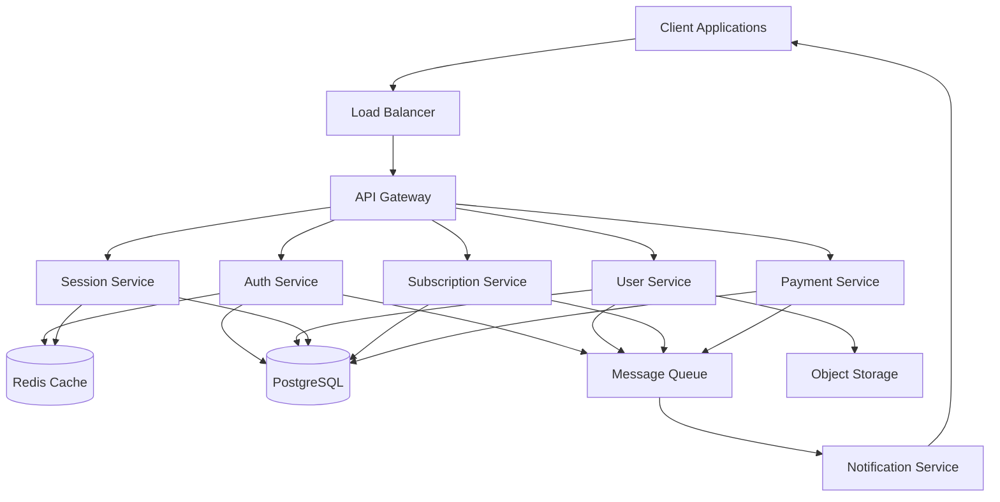
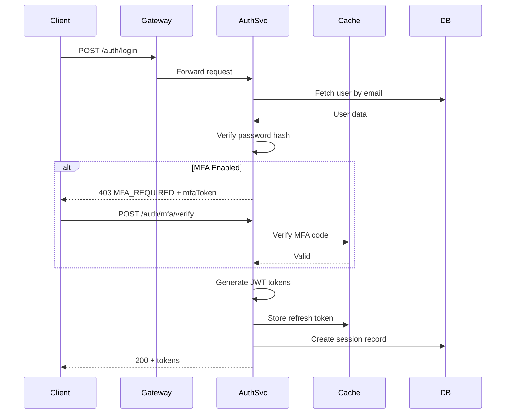

# Design Document

## Overview

The Enterprise Authentication System is a microservices-based platform providing comprehensive authentication, authorization, and user management capabilities. The system follows a modular architecture with clear separation of concerns, enabling independent scaling and deployment of components.

### Architecture Principles

- **Microservices Architecture**: Services are independently deployable and scalable
- **API-First Design**: All functionality exposed through well-documented REST APIs
- **Security by Default**: Defense-in-depth with multiple security layers
- **Cloud-Native**: Designed for containerized deployment on Kubernetes
- **Event-Driven**: Asynchronous communication for non-critical operations
- **SOLID Principles**: Maintainable, testable, and extensible codebase

## Architecture

### High-Level Architecture



### Service Responsibilities

**API Gateway**
- Request routing and load balancing
- Rate limiting and throttling
- API versioning
- Request/response transformation
- CORS handling
- SSL termination

**Auth Service**
- Password authentication (bcrypt/Argon2)
- OAuth 2.0 flows (Google, Facebook, GitHub)
- Multi-factor authentication (SMS, Email, TOTP)
- JWT token generation and validation
- Password reset and account recovery

**User Service**
- User registration and profile management
- Email verification
- Avatar upload and image processing
- User preferences and settings
- Account lifecycle (activation, deactivation, deletion)
- GDPR compliance (data export, deletion)

**Session Service**
- Session creation and validation
- Device tracking and fingerprinting
- Concurrent session management
- Activity logging
- Session revocation

**Subscription Service**
- Subscription tier management
- Usage tracking and quota enforcement
- Upgrade/downgrade workflows
- Trial period management
- Feature flag evaluation

**Payment Service**
- Payment method tokenization
- Recurring billing automation
- Invoice generation
- Payment retry logic
- Webhook handling from payment processors

**Notification Service**
- Email delivery (verification, password reset, invoices)
- SMS delivery (MFA codes)
- Push notifications
- Template management
- Delivery tracking

### Technology Stack

**Backend Services**
- Language: Node.js (TypeScript) for rapid development and async I/O
- Framework: Express.js with middleware architecture
- Alternative: Go for high-performance critical services

**Databases**
- Primary: PostgreSQL 14+ for relational data with JSONB support
- Cache: Redis 7+ for sessions, rate limiting, and caching
- Search: Elasticsearch for audit logs and analytics (optional)

**Message Queue**
- RabbitMQ or Apache Kafka for event-driven communication
- Dead letter queues for failed message handling

**Storage**
- Object Storage: AWS S3 / MinIO for avatars and documents
- CDN: CloudFront / Cloudflare for static asset delivery

**Authentication & Security**
- JWT for stateless authentication tokens
- Argon2id for password hashing
- TOTP libraries: speakeasy (Node.js)
- OAuth libraries: passport.js with strategies

**Infrastructure**
- Containers: Docker
- Orchestration: Kubernetes
- Service Mesh: Istio (optional for advanced traffic management)
- Monitoring: Prometheus + Grafana
- Logging: ELK Stack (Elasticsearch, Logstash, Kibana)
- Tracing: Jaeger for distributed tracing

## Components and Interfaces

### Auth Service API

```typescript
// POST /api/v1/auth/register
interface RegisterRequest {
  email: string;
  password: string;
  captchaToken: string;
}

interface RegisterResponse {
  userId: string;
  message: string; // "Verification email sent"
}

// POST /api/v1/auth/login
interface LoginRequest {
  email: string;
  password: string;
}

interface LoginResponse {
  accessToken: string;
  refreshToken: string;
  expiresIn: number;
  requiresMfa: boolean;
  mfaToken?: string; // Temporary token if MFA required
}

// POST /api/v1/auth/mfa/verify
interface MfaVerifyRequest {
  mfaToken: string;
  code: string;
  method: 'sms' | 'email' | 'totp';
}

interface MfaVerifyResponse {
  accessToken: string;
  refreshToken: string;
  expiresIn: number;
}

// POST /api/v1/auth/oauth/{provider}/authorize
interface OAuthAuthorizeResponse {
  redirectUrl: string;
}

// GET /api/v1/auth/oauth/{provider}/callback
interface OAuthCallbackResponse {
  accessToken: string;
  refreshToken: string;
  expiresIn: number;
}

// POST /api/v1/auth/password/reset-request
interface PasswordResetRequest {
  email: string;
}

// POST /api/v1/auth/password/reset
interface PasswordResetSubmit {
  token: string;
  newPassword: string;
}

// POST /api/v1/auth/refresh
interface RefreshTokenRequest {
  refreshToken: string;
}

interface RefreshTokenResponse {
  accessToken: string;
  expiresIn: number;
}
```

### User Service API

```typescript
// GET /api/v1/users/me
interface UserProfile {
  id: string;
  email: string;
  emailVerified: boolean;
  name: string;
  avatarUrl?: string;
  phoneNumber?: string;
  bio?: string;
  preferences: UserPreferences;
  roles: string[];
  createdAt: string;
  updatedAt: string;
}

interface UserPreferences {
  language: string;
  timezone: string;
  notifications: {
    email: boolean;
    sms: boolean;
    push: boolean;
  };
}

// PATCH /api/v1/users/me
interface UpdateProfileRequest {
  name?: string;
  phoneNumber?: string;
  bio?: string;
  preferences?: Partial<UserPreferences>;
}

// POST /api/v1/users/me/avatar
// Content-Type: multipart/form-data
interface AvatarUploadResponse {
  avatarUrl: string;
  thumbnails: {
    small: string;   // 50x50
    medium: string;  // 150x150
    large: string;   // 300x300
  };
}

// POST /api/v1/users/me/deactivate
// DELETE /api/v1/users/me (soft delete with 30-day grace period)

// GET /api/v1/users/me/data-export (GDPR compliance)
interface DataExportResponse {
  downloadUrl: string;
  expiresAt: string;
}
```

### Session Service API

```typescript
// GET /api/v1/sessions
interface SessionList {
  sessions: Session[];
}

interface Session {
  id: string;
  deviceInfo: {
    userAgent: string;
    browser: string;
    os: string;
    device: string;
  };
  ipAddress: string;
  location?: {
    country: string;
    city: string;
  };
  createdAt: string;
  lastActivityAt: string;
  isCurrent: boolean;
}

// DELETE /api/v1/sessions/{sessionId}
// DELETE /api/v1/sessions (revoke all except current)
```

### RBAC Service API

```typescript
// GET /api/v1/roles
interface Role {
  id: string;
  name: string;
  description: string;
  permissions: string[];
  parentRoleId?: string;
}

// POST /api/v1/roles (admin only)
interface CreateRoleRequest {
  name: string;
  description: string;
  permissions: string[];
  parentRoleId?: string;
}

// GET /api/v1/permissions
interface Permission {
  id: string;
  resource: string;
  action: string;
  description: string;
}

// POST /api/v1/users/{userId}/roles (admin only)
interface AssignRoleRequest {
  roleId: string;
}
```

### Subscription Service API

```typescript
// GET /api/v1/subscriptions/plans
interface SubscriptionPlan {
  id: string;
  name: string;
  description: string;
  price: number;
  currency: string;
  interval: 'month' | 'year';
  features: string[];
  limits: {
    apiCalls: number;
    storage: number;
    users: number;
  };
}

// GET /api/v1/subscriptions/me
interface UserSubscription {
  id: string;
  planId: string;
  status: 'active' | 'past_due' | 'canceled' | 'trialing';
  currentPeriodStart: string;
  currentPeriodEnd: string;
  cancelAtPeriodEnd: boolean;
  usage: {
    apiCalls: number;
    storage: number;
    users: number;
  };
}

// POST /api/v1/subscriptions/subscribe
interface SubscribeRequest {
  planId: string;
  paymentMethodId: string;
}

// POST /api/v1/subscriptions/change-plan
interface ChangePlanRequest {
  newPlanId: string;
  prorationBehavior: 'create_prorations' | 'none';
}

// POST /api/v1/subscriptions/cancel
```

### Payment Service API

```typescript
// POST /api/v1/payments/methods
interface AddPaymentMethodRequest {
  type: 'card' | 'bank_account';
  token: string; // From payment processor client-side tokenization
}

interface PaymentMethod {
  id: string;
  type: string;
  last4: string;
  brand?: string;
  expiryMonth?: number;
  expiryYear?: number;
  isDefault: boolean;
}

// GET /api/v1/payments/methods
interface PaymentMethodList {
  methods: PaymentMethod[];
}

// DELETE /api/v1/payments/methods/{methodId}

// GET /api/v1/payments/invoices
interface Invoice {
  id: string;
  number: string;
  amount: number;
  currency: string;
  status: 'draft' | 'open' | 'paid' | 'void';
  createdAt: string;
  dueDate: string;
  pdfUrl: string;
}

// POST /api/v1/payments/webhooks (for payment processor callbacks)
```

## Data Models

### User Model

```typescript
interface User {
  id: string;
  email: string;
  emailVerified: boolean;
  passwordHash?: string; // Null for OAuth-only users
  name: string;
  avatarUrl?: string;
  phoneNumber?: string;
  phoneVerified: boolean;
  bio?: string;
  preferences: UserPreferences;
  mfaEnabled: boolean;
  mfaMethod?: 'sms' | 'email' | 'totp';
  mfaSecret?: string; // Encrypted TOTP secret
  backupCodes?: string[]; // Hashed backup codes
  securityQuestions?: SecurityQuestion[];
  status: 'active' | 'deactivated' | 'deleted';
  deletedAt?: string;
  createdAt: string;
  updatedAt: string;
}

interface SecurityQuestion {
  question: string;
  answerHash: string;
}

interface UserPreferences {
  language: string;
  timezone: string;
  notifications: {
    email: boolean;
    sms: boolean;
    push: boolean;
  };
}
```

### OAuth Account Model

```typescript
interface OAuthAccount {
  id: string;
  userId: string;
  provider: 'google' | 'facebook' | 'github';
  providerAccountId: string;
  accessToken: string; // Encrypted
  refreshToken?: string; // Encrypted
  expiresAt?: string;
  scope: string;
  createdAt: string;
  updatedAt: string;
}
```

### Session Model

```typescript
interface Session {
  id: string;
  userId: string;
  token: string; // Hashed session token
  deviceInfo: DeviceInfo;
  ipAddress: string;
  location?: GeoLocation;
  createdAt: string;
  lastActivityAt: string;
  expiresAt: string;
}

interface DeviceInfo {
  userAgent: string;
  browser: string;
  browserVersion: string;
  os: string;
  osVersion: string;
  device: string;
  fingerprint: string;
}

interface GeoLocation {
  country: string;
  countryCode: string;
  city: string;
  latitude: number;
  longitude: number;
}
```

### Role Model

```typescript
interface Role {
  id: string;
  name: string;
  description: string;
  parentRoleId?: string;
  permissions: string[];
  isSystem: boolean; // System roles cannot be deleted
  createdAt: string;
  updatedAt: string;
}

interface UserRole {
  userId: string;
  roleId: string;
  assignedAt: string;
  assignedBy: string;
}
```

### Subscription Model

```typescript
interface Subscription {
  id: string;
  userId: string;
  planId: string;
  status: 'active' | 'past_due' | 'canceled' | 'trialing' | 'incomplete';
  currentPeriodStart: string;
  currentPeriodEnd: string;
  cancelAtPeriodEnd: boolean;
  canceledAt?: string;
  trialStart?: string;
  trialEnd?: string;
  paymentMethodId?: string;
  createdAt: string;
  updatedAt: string;
}

interface SubscriptionPlan {
  id: string;
  name: string;
  description: string;
  price: number;
  currency: string;
  interval: 'month' | 'year';
  intervalCount: number;
  features: Record<string, boolean>;
  limits: {
    apiCalls: number;
    storage: number;
    users: number;
  };
  isActive: boolean;
  createdAt: string;
  updatedAt: string;
}

interface UsageRecord {
  id: string;
  userId: string;
  subscriptionId: string;
  metric: string;
  quantity: number;
  timestamp: string;
}
```

### Payment Model

```typescript
interface PaymentMethod {
  id: string;
  userId: string;
  type: 'card' | 'bank_account';
  processorId: string; // ID from Stripe/PayPal
  last4: string;
  brand?: string;
  expiryMonth?: number;
  expiryYear?: number;
  isDefault: boolean;
  createdAt: string;
  updatedAt: string;
}

interface Invoice {
  id: string;
  userId: string;
  subscriptionId: string;
  number: string;
  amount: number;
  currency: string;
  status: 'draft' | 'open' | 'paid' | 'void' | 'uncollectible';
  description: string;
  dueDate: string;
  paidAt?: string;
  attemptCount: number;
  nextAttemptAt?: string;
  pdfUrl?: string;
  createdAt: string;
  updatedAt: string;
}

interface Payment {
  id: string;
  invoiceId: string;
  userId: string;
  amount: number;
  currency: string;
  status: 'pending' | 'succeeded' | 'failed' | 'refunded';
  paymentMethodId: string;
  processorPaymentId: string;
  failureReason?: string;
  createdAt: string;
  updatedAt: string;
}
```

### Audit Log Model

```typescript
interface AuditLog {
  id: string;
  userId?: string;
  action: string;
  resource: string;
  resourceId?: string;
  changes?: Record<string, any>;
  ipAddress: string;
  userAgent: string;
  status: 'success' | 'failure';
  errorMessage?: string;
  timestamp: string;
}
```

## Error Handling

### Error Response Format

All API errors follow a consistent structure:

```typescript
interface ErrorResponse {
  error: {
    code: string;
    message: string;
    details?: Record<string, any>;
    requestId: string;
    timestamp: string;
  };
}
```

### Error Codes and HTTP Status Mapping

| Error Code | HTTP Status | Description |
|------------|-------------|-------------|
| INVALID_CREDENTIALS | 401 | Email or password is incorrect |
| UNAUTHORIZED | 401 | Authentication required |
| FORBIDDEN | 403 | Insufficient permissions |
| NOT_FOUND | 404 | Resource not found |
| EMAIL_ALREADY_EXISTS | 409 | Email is already registered |
| VALIDATION_ERROR | 400 | Request validation failed |
| RATE_LIMIT_EXCEEDED | 429 | Too many requests |
| MFA_REQUIRED | 403 | MFA verification needed |
| INVALID_MFA_CODE | 400 | MFA code is incorrect or expired |
| TOKEN_EXPIRED | 401 | Access token has expired |
| INVALID_TOKEN | 401 | Token is malformed or invalid |
| ACCOUNT_LOCKED | 403 | Account temporarily locked |
| ACCOUNT_DEACTIVATED | 403 | Account has been deactivated |
| EMAIL_NOT_VERIFIED | 403 | Email verification required |
| SUBSCRIPTION_REQUIRED | 402 | Active subscription required |
| QUOTA_EXCEEDED | 429 | Usage quota exceeded |
| PAYMENT_FAILED | 402 | Payment processing failed |
| INTERNAL_ERROR | 500 | Internal server error |

### Error Handling Strategy

**Client Errors (4xx)**
- Log at INFO level
- Return detailed error messages
- Include validation details for 400 errors
- Track failed authentication attempts

**Server Errors (5xx)**
- Log at ERROR level with full stack trace
- Return generic error message to client
- Alert on-call engineer for critical services
- Implement circuit breakers for downstream failures

**Retry Logic**
- Implement exponential backoff for transient failures
- Maximum 3 retry attempts for idempotent operations
- Dead letter queue for failed async operations

## Security Architecture

### Authentication Flow



### JWT Token Structure

**Access Token (Short-lived: 15 minutes)**
```json
{
  "sub": "user-id",
  "email": "user@example.com",
  "roles": ["user", "premium"],
  "permissions": ["users:read", "users:write"],
  "sessionId": "session-id",
  "iat": 1234567890,
  "exp": 1234568790,
  "iss": "auth.example.com",
  "aud": "api.example.com"
}
```

**Refresh Token (Long-lived: 30 days)**
```json
{
  "sub": "user-id",
  "sessionId": "session-id",
  "tokenFamily": "family-id",
  "iat": 1234567890,
  "exp": 1237159890,
  "iss": "auth.example.com"
}
```

### Token Refresh Flow with Rotation

- Refresh tokens are single-use
- Each refresh generates new access + refresh token pair
- Token family tracking detects replay attacks
- If reused refresh token detected, revoke entire token family

### Password Security

**Hashing Algorithm: Argon2id**
- Memory: 64 MB
- Iterations: 3
- Parallelism: 4
- Salt: 16 bytes (random per password)
- Output: 32 bytes

**Password Policy**
- Minimum 8 characters
- At least 1 uppercase letter
- At least 1 lowercase letter
- At least 1 number
- At least 1 special character
- Check against common password lists (Have I Been Pwned API)
- Password history: prevent reuse of last 5 passwords

### Rate Limiting Strategy

**Authentication Endpoints**
- Login: 5 attempts per 15 minutes per IP
- Registration: 3 attempts per hour per IP
- Password reset: 3 attempts per hour per email
- MFA verification: 5 attempts per 5 minutes per session

**API Endpoints**
- Authenticated: 1000 requests per hour per user
- Public: 100 requests per hour per IP
- Admin: 5000 requests per hour per user

**Implementation**
- Use Redis with sliding window algorithm
- Return `Retry-After` header on 429 responses
- Implement distributed rate limiting across instances

### CSRF Protection

- Generate unique CSRF token per session
- Store in httpOnly cookie
- Require token in custom header for state-changing requests
- Validate token on server before processing
- Rotate token after sensitive operations

### CORS Configuration

```typescript
const corsOptions = {
  origin: (origin, callback) => {
    const whitelist = process.env.ALLOWED_ORIGINS.split(',');
    if (whitelist.includes(origin) || !origin) {
      callback(null, true);
    } else {
      callback(new Error('Not allowed by CORS'));
    }
  },
  credentials: true,
  methods: ['GET', 'POST', 'PUT', 'PATCH', 'DELETE'],
  allowedHeaders: ['Content-Type', 'Authorization', 'X-CSRF-Token'],
  exposedHeaders: ['X-RateLimit-Remaining', 'X-RateLimit-Reset'],
  maxAge: 86400
};
```

### Input Sanitization

**SQL Injection Prevention**
- Use parameterized queries exclusively
- ORM with prepared statements (TypeORM, Prisma)
- Never concatenate user input into SQL

**XSS Prevention**
- Sanitize HTML input with DOMPurify
- Content-Security-Policy headers
- Escape output in templates
- Use textContent instead of innerHTML

**Command Injection Prevention**
- Avoid shell execution with user input
- Use language-native APIs instead of shell commands
- Whitelist allowed characters if shell execution necessary

### Data Encryption

**At Rest**
- Database: Transparent Data Encryption (TDE)
- Sensitive fields: AES-256-GCM with field-level encryption
- Encryption keys: AWS KMS / HashiCorp Vault
- Key rotation: Automatic every 90 days

**In Transit**
- TLS 1.3 minimum
- Strong cipher suites only
- HSTS with max-age=31536000
- Certificate pinning for mobile apps

**Encrypted Fields**
- OAuth tokens
- MFA secrets
- Payment tokens
- Security question answers (hashed, not encrypted)

## Testing Strategy

### Unit Tests

**Coverage Target: 80%+**

Focus areas:
- Password hashing and verification
- JWT generation and validation
- Permission checking logic
- Input validation functions
- Business logic in services

Tools:
- Jest for Node.js/TypeScript
- Sinon for mocking
- Istanbul for coverage reporting

### Integration Tests

Test service interactions:
- Auth flow end-to-end
- OAuth callback handling
- MFA verification flow
- Session management
- Payment processing
- Email delivery

Tools:
- Supertest for API testing
- Testcontainers for database/Redis
- Mock external APIs (OAuth providers, payment processors)

### Security Tests

**OWASP Top 10 Coverage**
- SQL Injection: Automated scanning with SQLMap
- XSS: Automated scanning with OWASP ZAP
- CSRF: Verify token validation
- Authentication bypass: Attempt unauthorized access
- Sensitive data exposure: Check encryption
- Rate limiting: Verify throttling works
- Security misconfiguration: Check headers and defaults

Tools:
- OWASP ZAP for automated scanning
- Burp Suite for manual testing
- npm audit / Snyk for dependency vulnerabilities

### Performance Tests

**Load Testing**
- Target: 1000 req/s with p95 latency < 200ms
- Concurrent users: 10,000
- Test duration: 30 minutes
- Ramp-up: 5 minutes

**Stress Testing**
- Find breaking point
- Test recovery after overload
- Verify graceful degradation

**Endurance Testing**
- Run at 70% capacity for 24 hours
- Monitor for memory leaks
- Check database connection pool

Tools:
- k6 for load testing
- Apache JMeter for complex scenarios
- Prometheus + Grafana for monitoring

### End-to-End Tests

User journey testing:
- Complete registration flow
- Login with MFA
- Profile update with avatar
- Subscription upgrade
- Payment processing
- Account deletion

Tools:
- Playwright or Cypress for browser automation
- Run in CI/CD pipeline
- Test across browsers (Chrome, Firefox, Safari)

## Deployment Architecture

### Kubernetes Resources

**Deployments**
```yaml
# Auth Service
replicas: 3
resources:
  requests:
    cpu: 500m
    memory: 512Mi
  limits:
    cpu: 1000m
    memory: 1Gi
```

**Services**
- ClusterIP for internal services
- LoadBalancer for API Gateway
- Headless service for StatefulSets

**ConfigMaps**
- Application configuration
- Feature flags
- CORS whitelist

**Secrets**
- Database credentials
- JWT signing keys
- OAuth client secrets
- Payment processor API keys
- Encryption keys

**Ingress**
```yaml
apiVersion: networking.k8s.io/v1
kind: Ingress
metadata:
  name: auth-system-ingress
  annotations:
    cert-manager.io/cluster-issuer: letsencrypt-prod
    nginx.ingress.kubernetes.io/rate-limit: "100"
spec:
  tls:
  - hosts:
    - api.example.com
    secretName: api-tls
  rules:
  - host: api.example.com
    http:
      paths:
      - path: /
        pathType: Prefix
        backend:
          service:
            name: api-gateway
            port:
              number: 80
```

### Database Schema Design

**Users Table**
```sql
CREATE TABLE users (
  id UUID PRIMARY KEY DEFAULT gen_random_uuid(),
  email VARCHAR(255) UNIQUE NOT NULL,
  email_verified BOOLEAN DEFAULT FALSE,
  password_hash VARCHAR(255),
  name VARCHAR(255) NOT NULL,
  avatar_url TEXT,
  phone_number VARCHAR(20),
  phone_verified BOOLEAN DEFAULT FALSE,
  bio TEXT,
  preferences JSONB DEFAULT '{}',
  mfa_enabled BOOLEAN DEFAULT FALSE,
  mfa_method VARCHAR(20),
  mfa_secret TEXT,
  backup_codes TEXT[],
  security_questions JSONB,
  status VARCHAR(20) DEFAULT 'active',
  deleted_at TIMESTAMP,
  created_at TIMESTAMP DEFAULT NOW(),
  updated_at TIMESTAMP DEFAULT NOW()
);

CREATE INDEX idx_users_email ON users(email);
CREATE INDEX idx_users_status ON users(status);
CREATE INDEX idx_users_created_at ON users(created_at);
```

**OAuth Accounts Table**
```sql
CREATE TABLE oauth_accounts (
  id UUID PRIMARY KEY DEFAULT gen_random_uuid(),
  user_id UUID NOT NULL REFERENCES users(id) ON DELETE CASCADE,
  provider VARCHAR(50) NOT NULL,
  provider_account_id VARCHAR(255) NOT NULL,
  access_token TEXT NOT NULL,
  refresh_token TEXT,
  expires_at TIMESTAMP,
  scope TEXT,
  created_at TIMESTAMP DEFAULT NOW(),
  updated_at TIMESTAMP DEFAULT NOW(),
  UNIQUE(provider, provider_account_id)
);

CREATE INDEX idx_oauth_user_id ON oauth_accounts(user_id);
CREATE INDEX idx_oauth_provider ON oauth_accounts(provider, provider_account_id);
```

**Sessions Table**
```sql
CREATE TABLE sessions (
  id UUID PRIMARY KEY DEFAULT gen_random_uuid(),
  user_id UUID NOT NULL REFERENCES users(id) ON DELETE CASCADE,
  token_hash VARCHAR(255) NOT NULL,
  device_info JSONB NOT NULL,
  ip_address INET NOT NULL,
  location JSONB,
  created_at TIMESTAMP DEFAULT NOW(),
  last_activity_at TIMESTAMP DEFAULT NOW(),
  expires_at TIMESTAMP NOT NULL
);

CREATE INDEX idx_sessions_user_id ON sessions(user_id);
CREATE INDEX idx_sessions_token_hash ON sessions(token_hash);
CREATE INDEX idx_sessions_expires_at ON sessions(expires_at);
```

**Roles Table**
```sql
CREATE TABLE roles (
  id UUID PRIMARY KEY DEFAULT gen_random_uuid(),
  name VARCHAR(100) UNIQUE NOT NULL,
  description TEXT,
  parent_role_id UUID REFERENCES roles(id),
  permissions TEXT[] NOT NULL DEFAULT '{}',
  is_system BOOLEAN DEFAULT FALSE,
  created_at TIMESTAMP DEFAULT NOW(),
  updated_at TIMESTAMP DEFAULT NOW()
);

CREATE INDEX idx_roles_name ON roles(name);
CREATE INDEX idx_roles_parent ON roles(parent_role_id);
```

**User Roles Table**
```sql
CREATE TABLE user_roles (
  user_id UUID NOT NULL REFERENCES users(id) ON DELETE CASCADE,
  role_id UUID NOT NULL REFERENCES roles(id) ON DELETE CASCADE,
  assigned_at TIMESTAMP DEFAULT NOW(),
  assigned_by UUID REFERENCES users(id),
  PRIMARY KEY (user_id, role_id)
);

CREATE INDEX idx_user_roles_user ON user_roles(user_id);
CREATE INDEX idx_user_roles_role ON user_roles(role_id);
```

**Subscriptions Table**
```sql
CREATE TABLE subscription_plans (
  id UUID PRIMARY KEY DEFAULT gen_random_uuid(),
  name VARCHAR(100) NOT NULL,
  description TEXT,
  price DECIMAL(10, 2) NOT NULL,
  currency VARCHAR(3) DEFAULT 'USD',
  interval VARCHAR(20) NOT NULL,
  interval_count INTEGER DEFAULT 1,
  features JSONB DEFAULT '{}',
  limits JSONB NOT NULL,
  is_active BOOLEAN DEFAULT TRUE,
  created_at TIMESTAMP DEFAULT NOW(),
  updated_at TIMESTAMP DEFAULT NOW()
);

CREATE TABLE subscriptions (
  id UUID PRIMARY KEY DEFAULT gen_random_uuid(),
  user_id UUID NOT NULL REFERENCES users(id) ON DELETE CASCADE,
  plan_id UUID NOT NULL REFERENCES subscription_plans(id),
  status VARCHAR(20) NOT NULL,
  current_period_start TIMESTAMP NOT NULL,
  current_period_end TIMESTAMP NOT NULL,
  cancel_at_period_end BOOLEAN DEFAULT FALSE,
  canceled_at TIMESTAMP,
  trial_start TIMESTAMP,
  trial_end TIMESTAMP,
  payment_method_id UUID,
  created_at TIMESTAMP DEFAULT NOW(),
  updated_at TIMESTAMP DEFAULT NOW()
);

CREATE INDEX idx_subscriptions_user ON subscriptions(user_id);
CREATE INDEX idx_subscriptions_status ON subscriptions(status);
CREATE INDEX idx_subscriptions_period_end ON subscriptions(current_period_end);

CREATE TABLE usage_records (
  id UUID PRIMARY KEY DEFAULT gen_random_uuid(),
  user_id UUID NOT NULL REFERENCES users(id) ON DELETE CASCADE,
  subscription_id UUID NOT NULL REFERENCES subscriptions(id) ON DELETE CASCADE,
  metric VARCHAR(50) NOT NULL,
  quantity INTEGER NOT NULL,
  timestamp TIMESTAMP DEFAULT NOW()
);

CREATE INDEX idx_usage_user_metric ON usage_records(user_id, metric, timestamp);
CREATE INDEX idx_usage_subscription ON usage_records(subscription_id);
```

**Payments Table**
```sql
CREATE TABLE payment_methods (
  id UUID PRIMARY KEY DEFAULT gen_random_uuid(),
  user_id UUID NOT NULL REFERENCES users(id) ON DELETE CASCADE,
  type VARCHAR(20) NOT NULL,
  processor_id VARCHAR(255) NOT NULL,
  last4 VARCHAR(4) NOT NULL,
  brand VARCHAR(50),
  expiry_month INTEGER,
  expiry_year INTEGER,
  is_default BOOLEAN DEFAULT FALSE,
  created_at TIMESTAMP DEFAULT NOW(),
  updated_at TIMESTAMP DEFAULT NOW()
);

CREATE INDEX idx_payment_methods_user ON payment_methods(user_id);

CREATE TABLE invoices (
  id UUID PRIMARY KEY DEFAULT gen_random_uuid(),
  user_id UUID NOT NULL REFERENCES users(id) ON DELETE CASCADE,
  subscription_id UUID REFERENCES subscriptions(id),
  number VARCHAR(50) UNIQUE NOT NULL,
  amount DECIMAL(10, 2) NOT NULL,
  currency VARCHAR(3) DEFAULT 'USD',
  status VARCHAR(20) NOT NULL,
  description TEXT,
  due_date TIMESTAMP NOT NULL,
  paid_at TIMESTAMP,
  attempt_count INTEGER DEFAULT 0,
  next_attempt_at TIMESTAMP,
  pdf_url TEXT,
  created_at TIMESTAMP DEFAULT NOW(),
  updated_at TIMESTAMP DEFAULT NOW()
);

CREATE INDEX idx_invoices_user ON invoices(user_id);
CREATE INDEX idx_invoices_status ON invoices(status);
CREATE INDEX idx_invoices_due_date ON invoices(due_date);

CREATE TABLE payments (
  id UUID PRIMARY KEY DEFAULT gen_random_uuid(),
  invoice_id UUID NOT NULL REFERENCES invoices(id) ON DELETE CASCADE,
  user_id UUID NOT NULL REFERENCES users(id) ON DELETE CASCADE,
  amount DECIMAL(10, 2) NOT NULL,
  currency VARCHAR(3) DEFAULT 'USD',
  status VARCHAR(20) NOT NULL,
  payment_method_id UUID REFERENCES payment_methods(id),
  processor_payment_id VARCHAR(255),
  failure_reason TEXT,
  created_at TIMESTAMP DEFAULT NOW(),
  updated_at TIMESTAMP DEFAULT NOW()
);

CREATE INDEX idx_payments_invoice ON payments(invoice_id);
CREATE INDEX idx_payments_user ON payments(user_id);
CREATE INDEX idx_payments_status ON payments(status);
```

**Audit Logs Table**
```sql
CREATE TABLE audit_logs (
  id UUID PRIMARY KEY DEFAULT gen_random_uuid(),
  user_id UUID REFERENCES users(id),
  action VARCHAR(100) NOT NULL,
  resource VARCHAR(100) NOT NULL,
  resource_id UUID,
  changes JSONB,
  ip_address INET NOT NULL,
  user_agent TEXT,
  status VARCHAR(20) NOT NULL,
  error_message TEXT,
  timestamp TIMESTAMP DEFAULT NOW()
);

CREATE INDEX idx_audit_logs_user ON audit_logs(user_id);
CREATE INDEX idx_audit_logs_resource ON audit_logs(resource, resource_id);
CREATE INDEX idx_audit_logs_timestamp ON audit_logs(timestamp);
CREATE INDEX idx_audit_logs_action ON audit_logs(action);
```

### Caching Strategy

**Redis Cache Structure**

**Session Cache**
```
Key: session:{sessionId}
Value: JSON serialized session data
TTL: 15 minutes (access token lifetime)
```

**User Cache**
```
Key: user:{userId}
Value: JSON serialized user profile
TTL: 5 minutes
Invalidate on: Profile update, role change
```

**Rate Limit Cache**
```
Key: ratelimit:{endpoint}:{identifier}
Value: Request count
TTL: Window duration (e.g., 15 minutes)
Algorithm: Sliding window counter
```

**Permission Cache**
```
Key: permissions:{userId}
Value: Set of permission strings
TTL: 10 minutes
Invalidate on: Role assignment change
```

**MFA Code Cache**
```
Key: mfa:{mfaToken}:{method}
Value: Hashed code
TTL: 5 minutes (code validity)
```

**OAuth State Cache**
```
Key: oauth:state:{stateToken}
Value: JSON with redirect URL and CSRF token
TTL: 10 minutes
```

### Monitoring and Observability

**Metrics to Track**

Application Metrics:
- Request rate (req/s)
- Response time (p50, p95, p99)
- Error rate by endpoint
- Authentication success/failure rate
- Active sessions count
- MFA verification success rate

Business Metrics:
- New user registrations
- Daily/Monthly active users
- Subscription conversions
- Churn rate
- Revenue (MRR, ARR)
- Payment success/failure rate

Infrastructure Metrics:
- CPU usage per service
- Memory usage per service
- Database connection pool utilization
- Redis cache hit rate
- Queue depth and processing time
- Pod restart count

**Logging Strategy**

Log Levels:
- ERROR: Application errors, failed requests
- WARN: Degraded performance, retry attempts
- INFO: Successful operations, state changes
- DEBUG: Detailed execution flow (dev only)

Structured Logging Format:
```json
{
  "timestamp": "2024-01-15T10:30:00Z",
  "level": "INFO",
  "service": "auth-service",
  "traceId": "abc123",
  "spanId": "def456",
  "userId": "user-123",
  "action": "login",
  "status": "success",
  "duration": 145,
  "metadata": {}
}
```

**Alerting Rules**

Critical Alerts (Page on-call):
- Error rate > 5% for 5 minutes
- p95 latency > 1s for 5 minutes
- Service down (health check failing)
- Database connection pool exhausted
- Payment processing failure rate > 10%

Warning Alerts (Slack notification):
- Error rate > 2% for 10 minutes
- p95 latency > 500ms for 10 minutes
- Cache hit rate < 80%
- Disk usage > 80%
- High memory usage (> 85%)

**Distributed Tracing**

Use Jaeger for request tracing:
- Trace authentication flows across services
- Identify bottlenecks in request processing
- Debug complex multi-service interactions
- Track external API calls (OAuth, payment processors)

## SDK Design

### JavaScript/TypeScript SDK

```typescript
import { AuthClient } from '@auth-system/sdk';

const client = new AuthClient({
  apiUrl: 'https://api.example.com',
  apiKey: 'your-api-key',
  version: 'v1'
});

// Register
await client.auth.register({
  email: 'user@example.com',
  password: 'SecurePass123!',
  captchaToken: 'token'
});

// Login
const { accessToken, refreshToken } = await client.auth.login({
  email: 'user@example.com',
  password: 'SecurePass123!'
});

// Set token for authenticated requests
client.setAccessToken(accessToken);

// Get profile
const profile = await client.users.getProfile();

// Update profile
await client.users.updateProfile({
  name: 'John Doe'
});

// Upload avatar
await client.users.uploadAvatar(file);

// OAuth login
const authUrl = await client.auth.getOAuthUrl('google');
// Redirect user to authUrl
// Handle callback
const tokens = await client.auth.handleOAuthCallback(code);
```

### Python SDK

```python
from auth_system import AuthClient

client = AuthClient(
    api_url='https://api.example.com',
    api_key='your-api-key',
    version='v1'
)

# Register
client.auth.register(
    email='user@example.com',
    password='SecurePass123!',
    captcha_token='token'
)

# Login
tokens = client.auth.login(
    email='user@example.com',
    password='SecurePass123!'
)

# Set token
client.set_access_token(tokens['accessToken'])

# Get profile
profile = client.users.get_profile()

# Update profile
client.users.update_profile(name='John Doe')

# Upload avatar
with open('avatar.jpg', 'rb') as f:
    client.users.upload_avatar(f)
```

### SDK Features

All SDKs provide:
- Automatic token refresh
- Retry logic with exponential backoff
- Request/response interceptors
- Type definitions (TypeScript, Python type hints)
- Error handling with custom exceptions
- Pagination helpers
- Webhook signature verification
- Rate limit handling

## Landing Page Design

### Page Structure

**Hero Section**
- Headline: "Enterprise Authentication Made Simple"
- Subheadline: "Secure, scalable, and developer-friendly auth for modern applications"
- CTA buttons: "Start Free Trial" and "View Documentation"
- Hero image: Dashboard screenshot or illustration

**Features Section**
- Multi-factor Authentication
- OAuth Social Login
- Role-Based Access Control
- Session Management
- Subscription Management
- Enterprise Security

**How It Works Section**
1. Integrate SDK in minutes
2. Configure authentication methods
3. Customize user experience
4. Scale with confidence

**Pricing Section**
- Free tier: 1,000 MAU, basic features
- Starter: $29/mo, 10,000 MAU, MFA included
- Professional: $99/mo, 50,000 MAU, advanced RBAC
- Enterprise: Custom pricing, unlimited MAU, SLA

**Testimonials Section**
- 3-4 customer quotes with logos
- Use cases from different industries
- Metrics: "Reduced auth implementation time by 80%"

**FAQ Section**
- Common questions about security, pricing, integration
- Links to documentation

**Footer**
- Links: Documentation, API Reference, Status Page, Blog
- Social media links
- Contact information

### SEO Optimization

- Title: "Enterprise Authentication & User Management | Auth System"
- Meta description: "Secure authentication platform with MFA, OAuth, RBAC, and subscription management. Developer-friendly APIs and SDKs."
- Open Graph tags for social sharing
- Structured data (Organization, Product, FAQPage)
- Semantic HTML5 elements
- Mobile-responsive design
- Fast loading (< 3s)
- Accessibility (WCAG 2.1 AA)

## Admin Dashboard Design

### Dashboard Overview

**Metrics Cards**
- Total Users
- Active Sessions
- Failed Login Attempts (24h)
- Revenue (MTD)

**Charts**
- User growth over time (line chart)
- Authentication methods breakdown (pie chart)
- Subscription tier distribution (bar chart)
- API usage by endpoint (bar chart)

### User Management

**User List**
- Search by email, name, ID
- Filters: Status, role, subscription tier, registration date
- Columns: Email, Name, Status, Roles, Created At, Actions
- Actions: View, Edit, Deactivate, Delete, Impersonate (with audit)

**User Detail View**
- Profile information
- Active sessions with revoke option
- Assigned roles and permissions
- Subscription details
- Activity log
- Audit trail

### Role Management

**Role List**
- Create, edit, delete roles
- View role hierarchy
- Permission assignment interface

**Permission Matrix**
- Grid view of resources × actions
- Bulk permission assignment
- Permission inheritance visualization

### System Settings

- OAuth provider configuration
- Email templates
- Security settings (password policy, MFA requirements)
- Rate limit configuration
- Feature flags
- Subscription plans management

### Audit Logs

- Searchable and filterable log viewer
- Export to CSV/JSON
- Real-time log streaming
- Retention policy configuration

## Design Decisions and Rationales

### Why Microservices?

**Pros:**
- Independent scaling of services
- Technology flexibility per service
- Fault isolation
- Easier to understand and maintain smaller codebases
- Team autonomy

**Cons:**
- Increased operational complexity
- Network latency between services
- Distributed transaction challenges

**Decision:** Use microservices for clear bounded contexts (auth, user, payment) but avoid over-fragmentation. Start with 5-6 core services.

### Why JWT for Authentication?

**Pros:**
- Stateless authentication
- Horizontal scaling without shared session store
- Cross-domain authentication
- Mobile-friendly

**Cons:**
- Cannot revoke tokens before expiration
- Token size larger than session IDs

**Decision:** Use short-lived access tokens (15 min) with refresh token rotation. Store refresh tokens in Redis for revocation capability.

### Why Argon2 over bcrypt?

**Argon2 advantages:**
- Winner of Password Hashing Competition (2015)
- Memory-hard algorithm (resistant to GPU attacks)
- Configurable memory, time, and parallelism
- Better security against modern attacks

**Decision:** Use Argon2id (hybrid mode) as primary, support bcrypt for migration scenarios.

### Why PostgreSQL over NoSQL?

**Pros:**
- ACID transactions for payment processing
- Complex queries for analytics
- Mature ecosystem and tooling
- JSONB for flexible schema where needed
- Strong consistency guarantees

**Decision:** PostgreSQL for primary data store. Consider adding Elasticsearch for audit log search and analytics if needed.

### Why Redis for Caching?

**Pros:**
- In-memory performance
- Rich data structures (strings, sets, sorted sets)
- Built-in TTL support
- Pub/sub for real-time features
- Widely adopted and battle-tested

**Decision:** Redis for sessions, rate limiting, and caching. Use Redis Cluster for high availability.

### Why Node.js/TypeScript?

**Pros:**
- Excellent async I/O for API services
- Large ecosystem (npm)
- TypeScript for type safety
- Fast development iteration
- Good performance for I/O-bound workloads

**Cons:**
- Single-threaded (use clustering)
- Not ideal for CPU-intensive tasks

**Decision:** Node.js/TypeScript for API services. Consider Go for performance-critical services if needed.

## Migration and Rollout Strategy

### Phase 1: Core Authentication (Weeks 1-4)
- Email/password authentication
- JWT token generation
- Basic user management
- Session management
- Database schema and migrations

### Phase 2: Enhanced Security (Weeks 5-6)
- MFA implementation (TOTP, SMS, Email)
- OAuth integration (Google, Facebook, GitHub)
- Rate limiting
- CSRF protection
- Security headers

### Phase 3: User Features (Weeks 7-8)
- Profile management
- Avatar upload and processing
- Email verification
- Password reset
- Account lifecycle

### Phase 4: RBAC (Weeks 9-10)
- Role and permission models
- Permission checking middleware
- Admin interface for role management
- Hierarchical role inheritance

### Phase 5: SaaS Features (Weeks 11-13)
- Subscription management
- Payment integration
- Usage tracking
- Customer portal
- Invoice generation

### Phase 6: Infrastructure (Weeks 14-15)
- Docker containerization
- Kubernetes deployment
- CI/CD pipeline
- Monitoring and alerting
- Load testing

### Phase 7: Developer Experience (Weeks 16-17)
- SDK development (JS, Python, Java, Go, Ruby)
- API documentation (OpenAPI/Swagger)
- Integration guides
- Code examples
- Landing page

### Phase 8: Polish and Launch (Weeks 18-20)
- Security audit
- Performance optimization
- Admin dashboard
- Marketing site
- Beta testing
- Production launch

## Conclusion

This design provides a comprehensive, scalable, and secure authentication and user management system. The microservices architecture enables independent scaling and deployment, while the chosen technology stack balances developer productivity with performance requirements. Security is built into every layer, from password hashing to rate limiting to encryption. The system is designed to meet enterprise requirements while remaining developer-friendly through well-documented APIs and multi-language SDKs.
